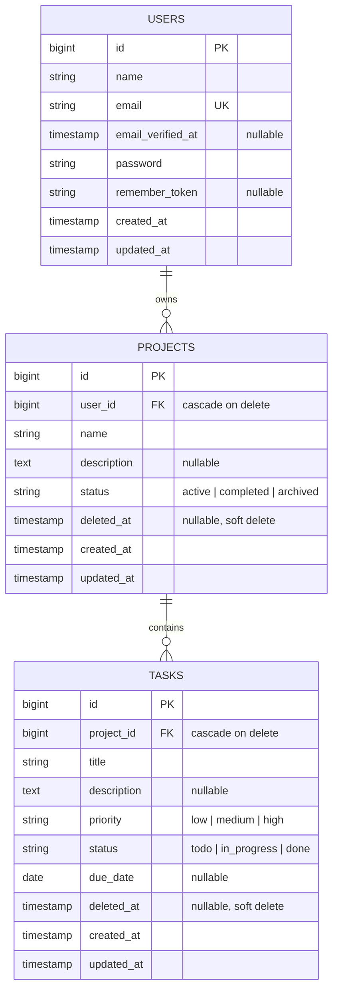

# Database Design (ERD)

Three domain tables: `users`, `projects`, `tasks`.

Relations: **User** `hasMany` **Project** → **Project** `hasMany` **Task**.
A user reaches their tasks through `User hasManyThrough Task`.

## Diagram

## Tables

### `users`

Laravel's default users table, unchanged.

| Column | Type | Notes |
|---|---|---|
| `id` | bigint unsigned | PK |
| `name` | string(255) | |
| `email` | string(255) | unique |
| `email_verified_at` | timestamp | nullable |
| `password` | string(255) | hashed |
| `remember_token` | string(100) | nullable |
| `created_at` / `updated_at` | timestamp | |

### `projects`

| Column | Type | Notes |
|---|---|---|
| `id` | bigint unsigned | PK |
| `user_id` | bigint unsigned | FK → `users.id`, `cascadeOnDelete` |
| `name` | string(255) | required |
| `description` | text | nullable |
| `status` | string(20) | default `active`; cast to `ProjectStatus` enum |
| `deleted_at` | timestamp | nullable — soft deletes |
| `created_at` / `updated_at` | timestamp | |

**Indexes:** `user_id` (from FK), composite `(user_id, status)` — every project query is
scoped to the authenticated user and the dashboard counts active projects per user.

### `tasks`

| Column | Type | Notes |
|---|---|---|
| `id` | bigint unsigned | PK |
| `project_id` | bigint unsigned | FK → `projects.id`, `cascadeOnDelete` |
| `title` | string(255) | required; searchable |
| `description` | text | nullable |
| `priority` | string(20) | default `medium`; cast to `TaskPriority` enum |
| `status` | string(20) | default `todo`; cast to `TaskStatus` enum |
| `due_date` | date | nullable |
| `deleted_at` | timestamp | nullable — soft deletes |
| `created_at` / `updated_at` | timestamp | |

**Indexes:** `project_id` (from FK), composite `(project_id, status)` and
`(project_id, priority)` for the list filters, and `due_date` for the overdue lookup.

## Enums

Stored as short strings and cast to PHP backed enums on the models. Strings keep the
schema portable between MySQL and the SQLite database used in tests, and adding a value
later needs no migration — while the PHP enum still gives type safety in application code
and a single source of truth for validation rules.

| Enum | Values |
|---|---|
| `ProjectStatus` | `active`, `completed`, `archived` |
| `TaskPriority` | `low`, `medium`, `high` |
| `TaskStatus` | `todo`, `in_progress`, `done` |

## Design Decisions

**Tasks have no `user_id`.** Ownership is derived through the parent project, which keeps
a single source of truth and makes an orphaned or mismatched owner impossible. `TaskPolicy`
authorizes against `$task->project->user_id`, and `User hasManyThrough Task` serves the
global task list and dashboard counts without denormalizing.

**Soft deletes on `projects` and `tasks` only.** Users are hard-deleted; the assessment
scopes soft deletes to the domain records.

**`cascadeOnDelete` on both foreign keys** guards against orphans if a record is ever
force-deleted. Under normal soft deletes the FK never fires, so deleting a project leaves
its tasks intact and restorable.

**`due_date` is a `date`, not a `datetime`.** Due dates are day-granular, so overdue means
`due_date < today AND status != done`.

## Supporting Tables

Framework tables created by the default Laravel and Sanctum migrations, not part of the
domain design: `personal_access_tokens` (Sanctum API tokens), `cache`, `cache_locks`,
`jobs`, `job_batches`, `failed_jobs`, `sessions`, `password_reset_tokens`.
